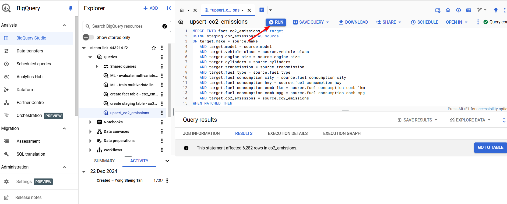

# Part 2b - Data processing with BigQuery SQL in BigQuery
Upserting Data from Staging to Fact Table to Avoid Duplicates
-------------------------------------------------------------

> Before you continue to this guide, you should have BigQuery table setup in your Google Cloud account. If you haven't set it up yet. Please refer to our guide on [Part 3 - Analytics Layer: Set up BigQuery](./Part%203%20-%20Analytics%20Layer.md), and then jump back to this guide.

BigQuery, a columnar analytics database, does not enforce constraints like unique keys, which means it allows inserting duplicate records. 

To prevent duplicates during the data insertion process, the `MERGE` statement can be used to upsert data from a staging table into a fact table, ensuring data consistency.



```SQL
-- upsert data from staging table to fact table, to avoid duplicates during insertion task

MERGE INTO fact.co2_emissions AS target
USING staging.co2_emissions AS source
ON target.make = source.make 
   AND target.model = source.model 
   AND target.vehicle_class = source.vehicle_class
   AND target.engine_size = source.engine_size
   AND target.cylinders = source.cylinders
   AND target.transmission = source.transmission
   AND target.fuel_type = source.fuel_type
   AND target.fuel_consumption_city = source.fuel_consumption_city
   AND target.fuel_consumption_hwy = source.fuel_consumption_hwy
   AND target.fuel_consumption_comb_lkm = source.fuel_consumption_comb_lkm
   AND target.fuel_consumption_comb_mpg = source.fuel_consumption_comb_mpg
   AND target.co2_emissions = source.co2_emissions
WHEN MATCHED THEN
UPDATE SET
    engine_size = source.engine_size,
    cylinders = source.cylinders,
    transmission = source.transmission,
    fuel_type = source.fuel_type,
    fuel_consumption_city = source.fuel_consumption_city,
    fuel_consumption_hwy = source.fuel_consumption_hwy,
    fuel_consumption_comb_lkm = source.fuel_consumption_comb_lkm,
    fuel_consumption_comb_mpg = source.fuel_consumption_comb_mpg,
    co2_emissions = source.co2_emissions
WHEN NOT MATCHED THEN
INSERT (make, model, vehicle_class, engine_size, cylinders, transmission, fuel_type, fuel_consumption_city, fuel_consumption_hwy, fuel_consumption_comb_lkm, fuel_consumption_comb_mpg, co2_emissions)
VALUES (source.make, source.model, source.vehicle_class, source.engine_size, source.cylinders, source.transmission, source.fuel_type, source.fuel_consumption_city, source.fuel_consumption_hwy, source.fuel_consumption_comb_lkm, source.fuel_consumption_comb_mpg, source.co2_emissions);
```

#### Query Breakdown

1.  **MERGE Operation**:  
    The `MERGE` statement combines both `UPDATE` and `INSERT` actions, depending on whether a matching record exists in the target table (`fact.co2_emissions`).
2.  **Matching Condition**:  
    The query uses multiple columns (such as `make`, `model`, `vehicle_class`, etc.) to check if a record in the target table already exists. These columns serve as the criteria for identifying duplicates.
3.  **When Matched (Update)**:  
    If a record with the same values for the matching columns exists in the `fact` table, the query updates it with the latest values from the `staging.co2_emissions` table.
4.  **When Not Matched (Insert)**:  
    If no matching record is found in the `fact` table, the query inserts a new row into the `fact` table using the values from the `staging` table.

#### Benefits

*   **Prevents Duplicates**: Ensures that data is not duplicated when performing an insertion.
*   **Maintains Data Integrity**: Updates existing records with the latest information while adding new data where necessary.
