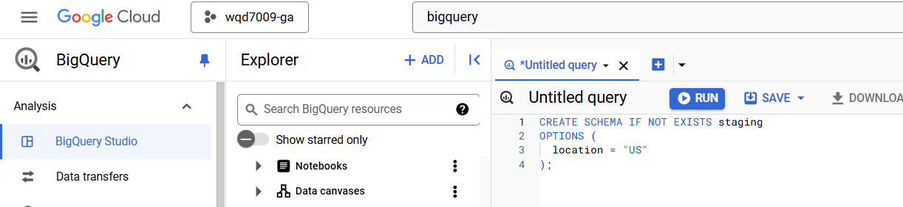
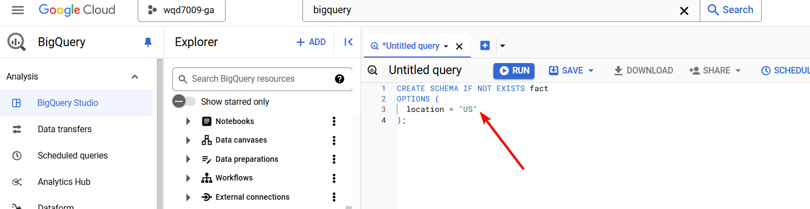

# Part 3 - Analytics Layer: Set up BigQuery
### Setting Up BigQuery Tables for CO2 Emissions Data

This guide outlines the steps to create the necessary BigQuery datasets and tables for storing CO2 emissions data.


Step 1: Create Datasets
-----------------------

Create two datasets in BigQuery for staging and fact tables:

First, create the dataset in BigQuery. We've created two datasets in our BigQuery database, which are:-

(i) staging dataset:



```sql
CREATE SCHEMA IF NOT EXISTS staging
OPTIONS (
  location = "US"
);
```

(ii) fact dataset:



```sql
CREATE SCHEMA IF NOT EXISTS fact
OPTIONS (
  location = "US"
);
```

You could also create them manually via the UI:


Step 2: Create Tables
---------------------

### Create Staging Table

*   The staging table will temporarily store the processed data before moving it to the fact table:


```sql
CREATE TABLE IF NOT EXISTS staging.co2_emissions (
  make STRING NOT NULL,
  model STRING NOT NULL,
  vehicle_class STRING NOT NULL,
  engine_size FLOAT64 NOT NULL,
  cylinders INT64 NOT NULL,
  transmission STRING NOT NULL,
  fuel_type STRING NOT NULL,
  fuel_consumption_city FLOAT64 NOT NULL,
  fuel_consumption_hwy FLOAT64 NOT NULL,
  fuel_consumption_comb_lkm FLOAT64 NOT NULL,
  fuel_consumption_comb_mpg INT64 NOT NULL,
  co2_emissions INT64 NOT NULL
);

```

### Create Fact Table

*   The fact table will store the final, clean data:


```sql
CREATE TABLE IF NOT EXISTS fact.co2_emissions (
  make STRING NOT NULL,
  model STRING NOT NULL,
  vehicle_class STRING NOT NULL,
  engine_size FLOAT64 NOT NULL,
  cylinders INT64 NOT NULL,
  transmission STRING NOT NULL,
  fuel_type STRING NOT NULL,
  fuel_consumption_city FLOAT64 NOT NULL,
  fuel_consumption_hwy FLOAT64 NOT NULL,
  fuel_consumption_comb_lkm FLOAT64 NOT NULL,
  fuel_consumption_comb_mpg INT64 NOT NULL,
  co2_emissions INT64 NOT NULL
);

```

Table Details
-------------

Both tables share identical schema with the following columns:

*   `make`
*   `model`
*   `vehicle_class`
*   `engine_size`
*   `cylinders`
*   `transmission`
*   `fuel_type`
*   `fuel_consumption_city`
*   `fuel_consumption_hwy`
*   `fuel_consumption_comb_lkm`
*   `fuel_consumption_comb_mpg`
*   `co2_emissions`

Refer more to the schema at [Data Dictionary](../dataset/).

Data Flow
---------

1.  Processed data from Dataproc is first loaded into the staging table
2.  Data is then merged into the fact table using the upsert operation, automated and orchestrated by Google Cloud Composer
3.  The staging table is used as a temporary landing zone to ensure data quality before final loading to avoid data duplication during data insertion, as BigQuery doesn't enforce unique key validation
