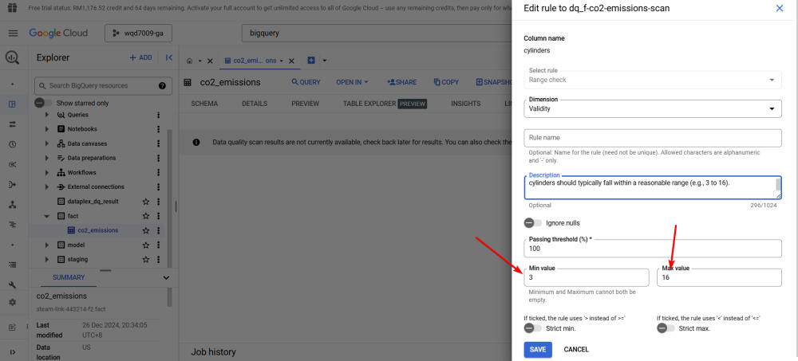
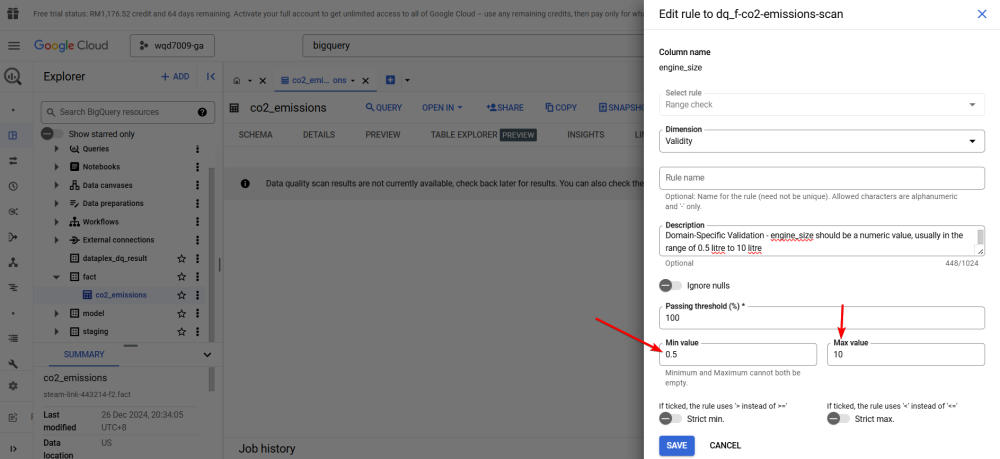
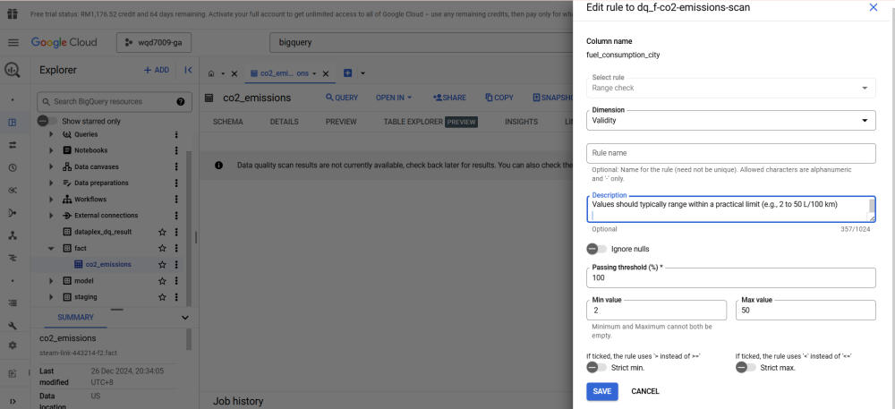
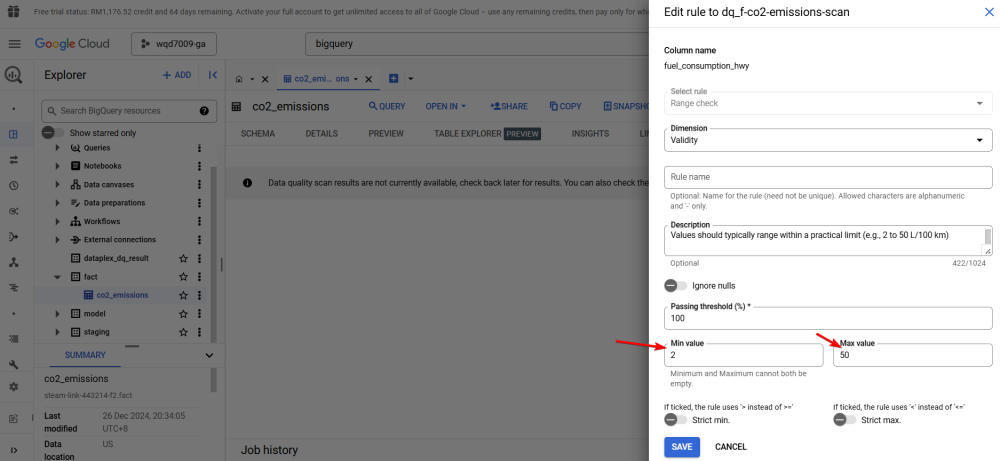

# Part 5 - Data Governance Layer with Dataplex
Data Governance Setup Guide with Dataplex
-----------------------------------------

Step 1: Enable Required APIs
----------------------------

*   First, enable the required Google Cloud services:

```bash
> gcloud services enable dataplex.googleapis.com
> gcloud services enable datalineage.googleapis.com
```


Step 2: Schema Creation
-----------------------

*   Create a schema for storing data quality results:

```sql
CREATE SCHEMA IF NOT EXISTS dataplex_dq_result
OPTIONS (
  location = "US"
);
```

Step 3: Data Profiling
----------------------

*   Set up data profiling for the `fact.co2_emissions` table


Step 4: Configure data quality scans
------------------------------------

*   Name your scan rule


*   If you choose 'On demand', your data quality scan will be 'one-time scan'. But, you could repeat your data quality scan at predefined schedule.


*   Create data quality scan rules, such as 'NULL CHECK' and 'RANGE CHECK', etc.


(I) NULL check


(II) RANGE check


Step 5: Data Validation Rules
-----------------------------

The image below shows the data validation rules that we're going to implement in Dataplex, to ensure our data integrity.


Here are the elaboration to some columns on why we enforce the data validation rules above: 

1\. `cylinders`

Values should typically fall within a reasonable range (e.g., 3 to 16).

*   3-4 cylinders: Common in small cars or motorcycles.
*   6-8 cylinders: Found in mid-sized and high-performance vehicles.
*   12-16 cylinders: Rare, typically in high-end luxury or performance cars (e.g., Bugatti, Ferrari).



2\. `engine_size`

Values should be a numeric value, usually in the range of 0.5 litre to 10 litre:

*   0.5-1.5 liters: Common in compact cars, motorcycles, and scooters.
*   1.6-3.5 liters: Found in most sedans, SUVs, and light trucks.
*   4.0-6.5 liters: Typical for high-performance or heavy-duty vehicles (e.g., sports cars, trucks).
*   7.0-10 liters: Rare but used in ultra-high-performance cars (e.g., Bugatti) or commercial vehicles.



3\. `fuel_consumption_city`

Values should typically range within a practical limit (e.g., 2 to 50 L/100 km)

*   2-5 L/100 km: Very efficient vehicles, including hybrid or electric cars.
*   6-15 L/100 km: Most compact cars, sedans, and small SUVs.
*   16-30 L/100 km: Larger vehicles like trucks, vans, or high-performance cars.
*   \>30 L/100 km: Heavy-duty or older, less efficient vehicles.



4\. `fuel_consumption_hwy`

Values should typically range within a practical limit (e.g., 2 to 50 L/100 km)

*   2-4 L/100 km: Highly efficient vehicles (e.g., hybrids, electric vehicles with energy equivalent metrics).
*   5-10 L/100 km: Most compact cars, sedans, and efficient SUVs.
*   11-20 L/100 km: Larger vehicles like trucks, vans, or high-performance cars.
*   \>20 L/100 km: Rare, usually for heavy-duty vehicles or vehicles with mechanical issues.



Step 6: Set up Logs management for Dataplex scan's result
---------------------------------------------------------

*   Then, we will enable logging for Dataplex scan results


*   Then, we can receive an email report after data quality scan is completed


Step 7: Set up Data Lineage Tracking
------------------------------------

*   Using Google Cloud Dataplex, you can automatically track data lineage for BigQuery tables, providing visibility into their source, transformations, and dependencies across your data ecosystem. 
*   This diagram below illustrates the data lineage of the `fact.co2_emissions` BigQuery table, showing its origins from two sources: a `Google Cloud Storage bucket` and the intermediate `staging.co2_emissions` table in BigQuery. This representation highlights how data flows and transformations occur, supporting transparency and governance within the pipeline


Step 8: Automated Data Catalogue
--------------------------------

*   The Dataplex UI, which functions as our data catalog, provides a convenient means for searching data assets.


